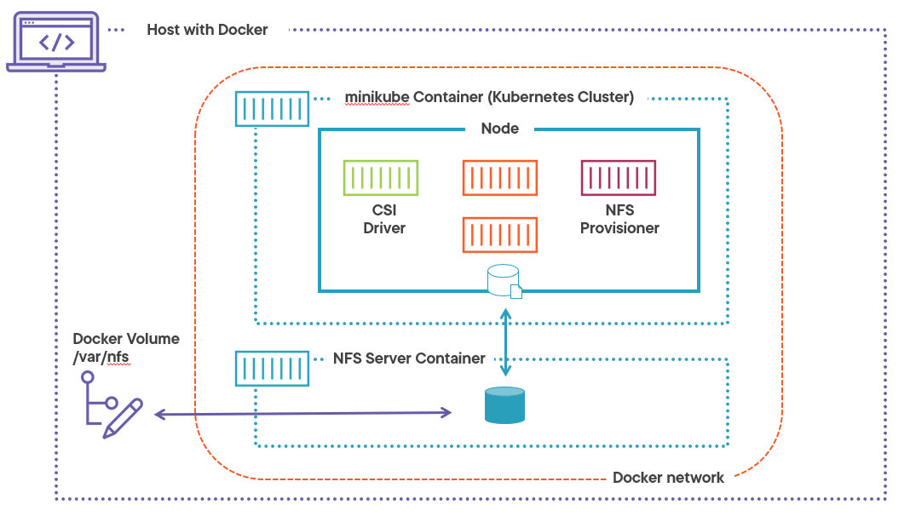

# NFS Server for Kubernetes (minikube)

Here is a minimalist NFS server for testing NFS Storage with Kubernetes (minikube)

Please note that this is only for testing, development and educational purposes.  

It has been developped for the course "Deploying Statefull Application to Kubernetes" @PluralSight.

## Environment
The environment consists in : 
- minikube running in Docker
- NFS server running in Docker in the minikube network
- Dynamic NFS Storage Provisioner (from [nfs-subdir-external-provisioner/deploy](nfs-subdir-external-provisioner/deploy))
- CSI NFS Driver (from [https://github.com/kubernetes-sigs/nfs-subdir-external-provisioner](https://github.com/kubernetes-sigs/nfs-subdir-external-provisioner))



## How to deploy
1. Download and run [minikube](https://minikube.sigs.k8s.io/docs/) with docker driver (install [Docker](https://docs.docker.com/) first if it is not already available on your platform)
```
minikube start
```
2. Run NFS server in Docker :
```
docker run -d --rm --privileged --name nfs-server  -v /var/nfs:/var/nfs  phico/nfs-server:latest
 ``` 
 By default, the NFS share is mounted with a volume in a `/var/nfs` directory on your host.

 3. Add the `nfs-server` container to minikube docker network :
``` 
docker network connect minikube nfs-server 
```
4. [Optional] Install NFS dynamic provisioner from [nfs-subdir-external-provisioner/deploy](nfs-subdir-external-provisioner/deploy) directory : 
```
kubectl create -f rbac.yaml
kubectl create -f deployment.yaml
kybectl create -f storageClass.yaml
``` 

Credit to project : [https://github.com/kubernetes-sigs/nfs-subdir-external-provisioner](https://github.com/kubernetes-sigs/nfs-subdir-external-provisioner).  

5. [Optional] Install NFS CSI Driver from [csi-driver-nfs/deploy](csi-driver-nfs/deploy)  directory :

```
kubectl create -f rbac-csi-nfs-controller.yaml
kubectl create -f csi-nfs-driverinfo.yaml
kubectl create -f csi-nfs-controller.yaml
kubectl create -f csi-nfs-node.yaml
```
Credit to project : [https://github.com/kubernetes-csi/csi-driver-nfs](https://github.com/kubernetes-csi/csi-driver-nfs). 


## How to use
Please check the [examples](examples) folder for following usages :
|                    |                         |
| ------------------ | --------------------|
| [busybox-nfs.yaml](examples/busybox-nfs.yaml)      | Volume in a pod |
| [busybox-nfs-pvc-pv.yaml](examples/busybox-nfs-pvc-pv.yaml)      |    Volume in a PersistentVolume with PersistentVolumeClaim |
| [busybox-nfs-pvc-pv-sc.yaml](examples/busybox-nfs-pvc-pv-sc.yaml) |    Volume in a PersistentVolume with StorageClass and dynamic provisioning : (Please note that you first have to install NFS dynamic provisioner as noted above)  |
| [busybox-nfs-pvc-pv-csi.yaml](examples/busybox-nfs-pvc-pv-csi.yaml) |    Volume in a PersistentVolume with StorageClass and dynamic provisioning based on CSI NFS driver : (Please note that you first have to install CSI NFS driver as noted above)  |

Sample usage :
```
kubectl create -f busybox-nfs-pvc-pv.yaml
kubectl delete -f busybox-nfs-pvc-pv.yaml
```


## How to build 

The prebuilt image is pushed on Docker Hub in this repository : [https://hub.docker.com/repository/docker/phico/nfs-server](https://hub.docker.com/repository/docker/phico/nfs-server)

If you want to modify the NFS server, the docker image source code is in [docker-image](docker-image) folder.
